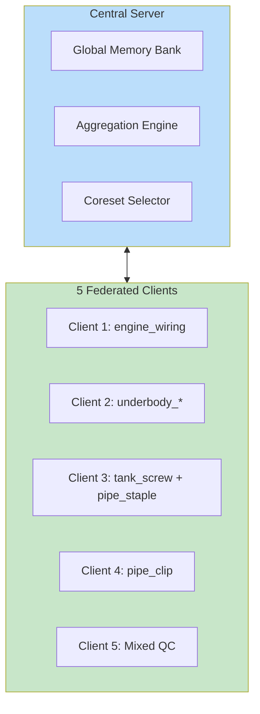

# Federated Learning for Industrial Anomaly Detection

> **Stage 1**: Baseline Development and Minimal Federated Setup
> **Domain**: Industrial Anomaly Detection (AutoVI Dataset)
> **Team Size**: 3 Members

---

## Project Overview

This project implements a **Federated Learning** system for **unsupervised anomaly detection** on the AutoVI dataset from Renault Group. The goal is to enable privacy-preserving collaborative model training across simulated industrial production lines while maintaining competitive anomaly detection performance.

### Key Objectives (Stage 1)

1. Implement a working **PatchCore baseline model** (centralized)
2. Demonstrate **federated learning** with 5 simulated clients
3. Compare **IID vs Non-IID** data partitioning strategies
4. Evaluate using standard metrics: **AUC-sPRO**, **AUC-ROC**

### Stage 2 Focus (Preview)

- **Privacy**: Differential Privacy (DP-SGD)
- **Fairness**: Cross-category performance equity

---

## Documentation Structure

```
docs/
├── index.md                          # This file
├── getting-started.md                # Setup and installation
│
├── phases/                           # Development phases
│   ├── phase-1-data-preparation/     # Data acquisition & preprocessing
│   ├── phase-2-baseline-model/       # PatchCore centralized training
│   ├── phase-3-federated-setup/      # FL client/server implementation
│   └── phase-4-evaluation/           # Metrics and comparison
│
├── technical-report/                 # Stage 1 report (3-4 pages)
│   └── sections/                     # Report sections
│
├── presentation/                     # Slide deck materials
│
├── api/                             # Code documentation
│
└── assets/                          # Diagrams, images
    └── diagrams/                    # Mermaid source files
```

---

## Quick Links

| Document | Description |
|----------|-------------|
| [Getting Started](getting-started.md) | Installation and environment setup |
| [Phase 1: Data Preparation](phases/phase-1-data-preparation/README.md) | Dataset loading and FL partitioning |
| [Phase 2: Baseline Model](phases/phase-2-baseline-model/README.md) | PatchCore architecture and training |
| [Phase 3: Federated Setup](phases/phase-3-federated-setup/README.md) | FL client/server implementation |
| [Phase 4: Evaluation](phases/phase-4-evaluation/README.md) | Metrics computation and analysis |
| [Technical Report](technical-report/README.md) | Stage 1 deliverable |
| [Presentation](presentation/README.md) | Slide deck and notes |

---

## System Architecture Overview



---

## Dataset Summary (AutoVI)

| Category | Train (good) | Test | Defect Types |
|----------|--------------|------|--------------|
| engine_wiring | 285 | 607 | fastening, blue_hoop, cardboard, obstruction |
| pipe_clip | 195 | 337 | unclipped, operator |
| pipe_staple | 191 | 305 | missing |
| tank_screw | 318 | 413 | missing |
| underbody_pipes | 161 | 345 | obstruction, operator |
| underbody_screw | 373 | 392 | missing |
| **Total** | **1,523** | **2,399** | **10 types** |

---

## Team Roles

| Role | Responsibilities |
|------|------------------|
| **Data & Experiment Lead** | Dataset preprocessing, FL partitioning, client simulation |
| **Modeling & Privacy Lead** | PatchCore implementation, DP-SGD integration (Stage 2) |
| **Evaluation & Fairness Lead** | Metrics computation, cross-category analysis |

---

## Technology Stack

- **Framework**: PyTorch 2.0+
- **FL Framework**: Flower (flwr) / Custom simulation
- **Feature Extraction**: WideResNet-50-2 (ImageNet pretrained)
- **Nearest Neighbor**: FAISS
- **Evaluation**: AutoVI evaluation code (existing)

---

## License

This project uses the AutoVI dataset under CC-BY-NC-SA 4.0 license.

**Citation**:
```bibtex
@dataset{carvalho2024autovi,
  author = {Carvalho, P. and Lafou, M. and Durupt, A. and Leblanc, A. and Grandvalet, Y.},
  title = {The Automotive Visual Inspection Dataset (AutoVI)},
  year = {2024},
  doi = {10.5281/zenodo.10459003}
}
```
