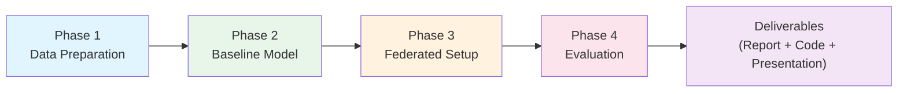
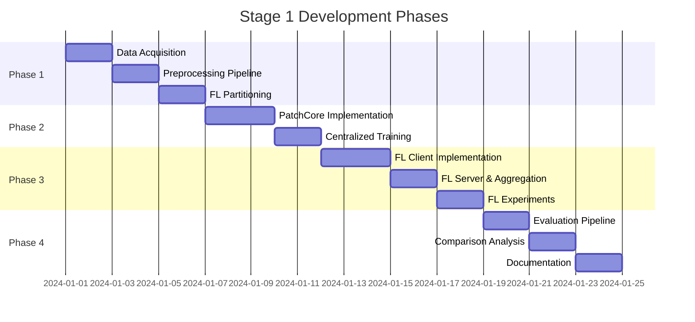
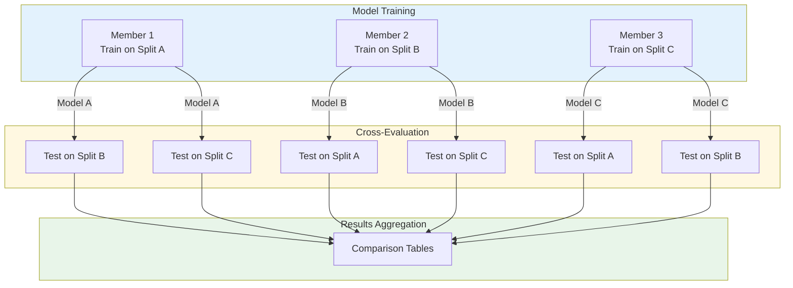

# Development Phases

This project is organized into **4 sequential phases** for Stage 1 development.

---

## Phase Overview

---

## Phase Summary

| Phase | Focus | Key Outputs |
|-------|-------|-------------|
| [Phase 1](phase-1-data-preparation/README.md) | Data Preparation | Dataset loader, FL partitions, EDA |
| [Phase 2](phase-2-baseline-model/README.md) | Baseline Model | PatchCore centralized training |
| [Phase 3](phase-3-federated-setup/README.md) | Federated Setup | FL client/server, memory aggregation |
| [Phase 4](phase-4-evaluation/README.md) | Evaluation | Metrics, comparison, analysis |

---

## Timeline and Dependencies

---

## Team Member Assignments

| Phase | Primary Lead | Support |
|-------|--------------|---------|
| Phase 1 | Data & Experiment Lead | All |
| Phase 2 | Modeling Lead | Data Lead |
| Phase 3 | Modeling Lead | Evaluation Lead |
| Phase 4 | Evaluation Lead | All |

---

## Cross-Evaluation Protocol

Per project guidelines, the team must implement **cross-evaluation**:

1. **Each member** trains a model variant on their assigned data split
2. **All models** are tested by other members on their local test partitions
3. **Results** are aggregated with inter-member comparison tables

