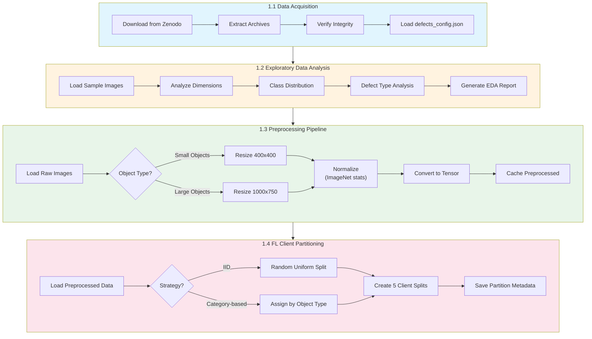

# Phase 1: Data Preparation

> **Objective**: Acquire, preprocess, and partition the AutoVI dataset for federated learning experiments.

---

## Overview

Phase 1 establishes the data foundation for all subsequent phases. This includes:

1. **Data Acquisition** - Download and verify AutoVI dataset
2. **Exploratory Data Analysis** - Understand data characteristics
3. **Preprocessing Pipeline** - Standardize images for model input
4. **FL Partitioning** - Create client data splits (IID and Non-IID)

---

## Workflow Diagram



---

## AutoVI Dataset Structure

### Directory Layout

```
autovi/
├── engine_wiring/
│   ├── train/
│   │   └── good/                    # 285 normal images
│   ├── test/
│   │   ├── good/                    # Normal test images
│   │   ├── structural_anomalies/    # Structural defects
│   │   └── logical_anomalies/       # Logical defects
│   ├── ground_truth/
│   │   ├── structural_anomalies/    # Pixel masks
│   │   └── logical_anomalies/
│   └── defects_config.json          # Defect definitions
├── pipe_clip/
├── pipe_staple/
├── tank_screw/
├── underbody_pipes/
└── underbody_screw/
```

### Dataset Statistics

| Category | Train | Test | Test Good | Test Anomaly | Defect Types |
|----------|-------|------|-----------|--------------|--------------|
| engine_wiring | 285 | 607 | 285 | 322 | 4 |
| pipe_clip | 195 | 337 | 195 | 142 | 2 |
| pipe_staple | 191 | 305 | 188 | 117 | 1 |
| tank_screw | 318 | 413 | 318 | 95 | 1 |
| underbody_pipes | 161 | 345 | 161 | 184 | 3 |
| underbody_screw | 373 | 392 | 374 | 18 | 1 |
| **Total** | **1,523** | **2,399** | **1,521** | **878** | **10** |

---

## Image Size Categories

The evaluation code defines specific resize dimensions per object type:

```python
# From evaluate_experiment.py
SMALL_OBJECTS = ["engine_wiring", "pipe_clip", "pipe_staple"]  # 400x400
LARGE_OBJECTS = ["tank_screw", "underbody_pipes", "underbody_screw"]  # 1000x750
```

---

## FL Client Partitioning Strategies

### Strategy 1: IID (Baseline)

Random uniform distribution across 5 clients:

| Client | Distribution | ~Images |
|--------|--------------|---------|
| Client 0-4 | 20% each category | ~305 each |

```python
def iid_partition(dataset, num_clients=5, seed=42):
    np.random.seed(seed)
    indices = np.random.permutation(len(dataset))
    return np.array_split(indices, num_clients)
```

### Strategy 2: Category-Based (Non-IID)

Realistic factory simulation:

| Client | Categories | Role | Images |
|--------|------------|------|--------|
| Client 1 | engine_wiring | Engine Assembly | 285 |
| Client 2 | underbody_pipes, underbody_screw | Underbody Line | 534 |
| Client 3 | tank_screw, pipe_staple | Fastener Station | 509 |
| Client 4 | pipe_clip | Clip Inspection | 195 |
| Client 5 | All (10% each) | Quality Control | ~150 |

```python
def category_partition(dataset, config):
    client_assignments = {
        0: ["engine_wiring"],
        1: ["underbody_pipes", "underbody_screw"],
        2: ["tank_screw", "pipe_staple"],
        3: ["pipe_clip"],
        4: ["all"],  # Mixed QC
    }
    # Implementation in src/data/partitioner.py
```

---

## Defect Configuration

Each category has a `defects_config.json` defining defect types:

```json
// engine_wiring/defects_config.json
[
  {"defect_name": "fastening", "pixel_value": 255, "saturation_threshold": 1.0, "relative_saturation": true},
  {"defect_name": "blue_hoop", "pixel_value": 254, "saturation_threshold": 800, "relative_saturation": false},
  {"defect_name": "cardboard", "pixel_value": 253, "saturation_threshold": 1.0, "relative_saturation": true},
  {"defect_name": "obstruction", "pixel_value": 252, "saturation_threshold": 1.0, "relative_saturation": true}
]
```

---

## Implementation Checklist

- [ ] Download AutoVI dataset from Zenodo
- [ ] Implement `AutoVIDataset` class in `src/data/autovi_dataset.py`
- [ ] Implement preprocessing pipeline in `src/data/preprocessing.py`
- [ ] Implement augmentation (optional) in `src/data/augmentation.py`
- [ ] Implement FL partitioner in `src/data/partitioner.py`
- [ ] Create EDA notebook `notebooks/01_data_exploration.ipynb`
- [ ] Validate data loading with unit tests

---

## Output Files

```
outputs/
├── partitions/
│   ├── iid_partition.json          # IID client assignments
│   ├── category_partition.json     # Category-based assignments
│   └── partition_stats.json        # Statistics per client
└── preprocessed/
    └── feature_cache/              # Cached WideResNet features (optional)
```

---

## Related Documentation

- [Preprocessing Workflow](workflows/data-pipeline.md) - Detailed BPMN diagram
- [Data Partitioning Details](client-partitioning.md) - In-depth partitioning guide
- [Phase 2: Baseline Model](../phase-2-baseline-model/README.md) - Next phase
