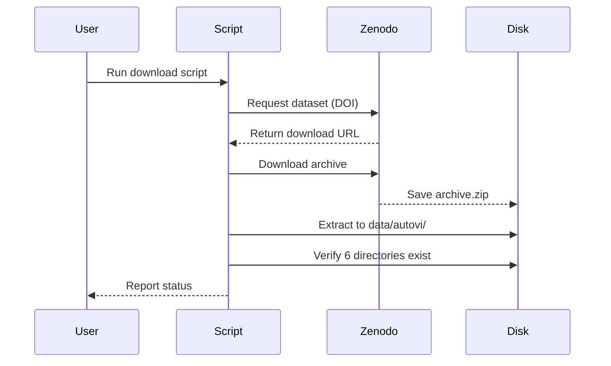
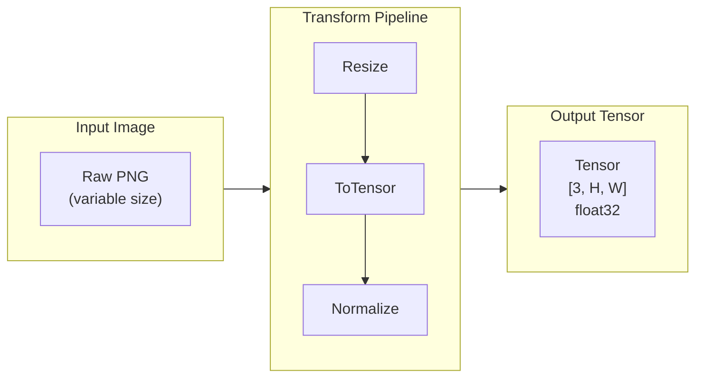
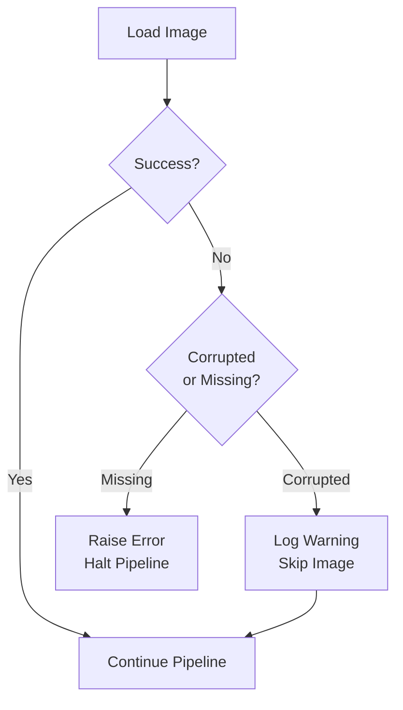

# Data Pipeline Workflow

> BPMN/Mermaid diagram for the complete data preparation pipeline.

---

## Complete Data Pipeline

```mermaid
flowchart TB
    %% Start
    START([Start]) --> A1

    %% Data Acquisition Subprocess
    subgraph Acquisition["Data Acquisition"]
        A1["Download AutoVI\nfrom Zenodo"] --> A2["Extract ZIP/TAR\nArchives"]
        A2 --> A3{"All 6\nCategories\nPresent?"}
        A3 -->|No| A4["Report Missing\nCategories"]
        A4 --> A1
        A3 -->|Yes| A5["Verify File\nIntegrity"]
        A5 --> A6["Load All\ndefects_config.json"]
    end

    %% EDA Subprocess
    subgraph EDA["Exploratory Data Analysis"]
        A6 --> B1["Sample Random\nImages (n=100)"]
        B1 --> B2["Compute Image\nDimension Stats"]
        B2 --> B3["Count Images\nper Category"]
        B3 --> B4["Count Defect\nTypes per Category"]
        B4 --> B5["Analyze Class\nImbalance"]
        B5 --> B6["Generate EDA\nReport + Plots"]
    end

    %% Preprocessing Subprocess
    subgraph Preprocessing["Image Preprocessing"]
        B6 --> C1["Initialize\nImage Loader"]
        C1 --> C2["For Each Image\nin Dataset"]
        C2 --> C3{"Object\nType?"}

        C3 -->|"engine_wiring\npipe_clip\npipe_staple"| C4["Resize to\n400x400"]
        C3 -->|"tank_screw\nunderbody_*"| C5["Resize to\n1000x750"]

        C4 --> C6["Normalize:\nmean=[0.485,0.456,0.406]\nstd=[0.229,0.224,0.225]"]
        C5 --> C6

        C6 --> C7["Convert to\nPyTorch Tensor"]
        C7 --> C8{"More\nImages?"}
        C8 -->|Yes| C2
        C8 -->|No| C9["Save Preprocessed\nDataset"]
    end

    %% Feature Extraction (Optional)
    subgraph FeatureExtract["Feature Extraction (Optional)"]
        C9 --> D1{"Cache\nFeatures?"}
        D1 -->|Yes| D2["Load WideResNet-50-2\n(ImageNet pretrained)"]
        D2 --> D3["Extract Layer2 + Layer3\nFeatures"]
        D3 --> D4["Save Feature\nCache to Disk"]
        D1 -->|No| D5["Skip Feature\nCaching"]
        D4 --> E1
        D5 --> E1
    end

    %% FL Partitioning Subprocess
    subgraph Partitioning["FL Client Partitioning"]
        E1["Load Dataset\nIndices"]

        E1 --> E2{"Partition\nStrategy?"}

        %% IID Branch
        E2 -->|IID| E3["Set Random\nSeed (42)"]
        E3 --> E4["Shuffle All\nIndices"]
        E4 --> E5["Split into 5\nEqual Parts"]

        %% Category Branch
        E2 -->|Category-based| E6["Group Indices\nby Object Type"]
        E6 --> E7["Assign Groups\nto Clients"]
        E7 --> E8["Client 1: engine_wiring\nClient 2: underbody_*\nClient 3: tank+staple\nClient 4: pipe_clip\nClient 5: mixed"]

        E5 --> E9["Create Client\nDataLoaders"]
        E8 --> E9

        E9 --> E10["Compute Per-Client\nStatistics"]
        E10 --> E11["Save Partition\nMetadata JSON"]
    end

    %% Validation
    subgraph Validation["Validation"]
        E11 --> F1["Verify No\nData Leakage"]
        F1 --> F2["Verify All\nImages Assigned"]
        F2 --> F3["Log Partition\nSummary"]
    end

    F3 --> END([End])

    %% Styling
    style Acquisition fill:#e1f5fe
    style EDA fill:#fff3e0
    style Preprocessing fill:#e8f5e9
    style FeatureExtract fill:#f3e5f5
    style Partitioning fill:#fce4ec
    style Validation fill:#e0f7fa
```

---

## Subprocess Details

### Data Acquisition Flow

### Preprocessing Transforms

---

## Error Handling

---

## Output Artifacts

| Artifact | Path | Description |
|----------|------|-------------|
| Partition JSON | `outputs/partitions/iid_partition.json` | IID client assignments |
| Partition JSON | `outputs/partitions/category_partition.json` | Category-based assignments |
| Statistics | `outputs/partitions/partition_stats.json` | Per-client statistics |
| Feature Cache | `outputs/preprocessed/feature_cache/` | Cached WideResNet features |
| EDA Report | `outputs/eda/eda_report.html` | Exploratory analysis |
