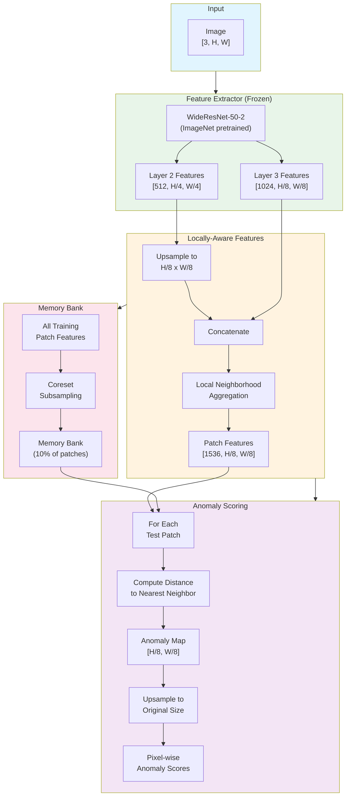
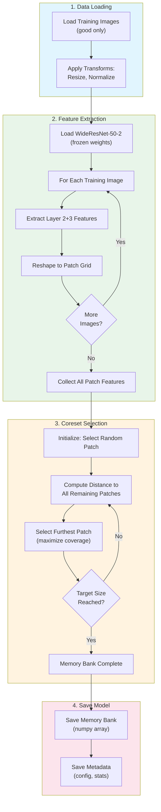

# Phase 2: Baseline Model (PatchCore)

> **Objective**: Implement and train a centralized PatchCore model as the baseline for comparison with federated approaches.

---

## Overview

PatchCore is a state-of-the-art anomaly detection method that uses:
1. **Pre-trained CNN backbone** (WideResNet-50-2) for feature extraction
2. **Memory bank** of representative normal patch features
3. **Nearest neighbor** scoring for anomaly detection

---

## PatchCore Architecture



---

## Training Workflow



---

## Implementation Details

### Backbone: WideResNet-50-2

```python
import torchvision.models as models

backbone = models.wide_resnet50_2(pretrained=True)
backbone.eval()  # Freeze weights

# Hook layers for feature extraction
features = {}
def hook_layer2(module, input, output):
    features['layer2'] = output
def hook_layer3(module, input, output):
    features['layer3'] = output

backbone.layer2.register_forward_hook(hook_layer2)
backbone.layer3.register_forward_hook(hook_layer3)
```

### Feature Dimensions

| Layer | Output Shape | Receptive Field |
|-------|--------------|-----------------|
| Layer 2 | [B, 512, H/4, W/4] | Local |
| Layer 3 | [B, 1024, H/8, W/8] | Mid-level |
| Concatenated | [B, 1536, H/8, W/8] | Combined |

### Coreset Subsampling

Greedy k-center algorithm:
1. Start with random patch
2. Iteratively add patch furthest from current set
3. Continue until target size (10% of total patches)

```python
def greedy_coreset(features, target_percentage=0.1):
    n_samples = features.shape[0]
    target_size = int(n_samples * target_percentage)

    # Initialize with random sample
    selected = [np.random.randint(n_samples)]
    min_distances = np.full(n_samples, np.inf)

    for _ in range(target_size - 1):
        # Update distances
        last_selected = features[selected[-1]]
        distances = np.linalg.norm(features - last_selected, axis=1)
        min_distances = np.minimum(min_distances, distances)
        min_distances[selected] = -1  # Exclude already selected

        # Select furthest
        selected.append(np.argmax(min_distances))

    return features[selected]
```

---

## Hyperparameters

```yaml
# experiments/configs/baseline/patchcore_config.yaml
model:
  backbone: "wide_resnet50_2"
  layers: ["layer2", "layer3"]
  coreset_percentage: 0.1
  neighborhood_size: 3

preprocessing:
  resize_small: [400, 400]   # engine_wiring, pipe_clip, pipe_staple
  resize_large: [1000, 750]  # tank_screw, underbody_*
  normalize_mean: [0.485, 0.456, 0.406]
  normalize_std: [0.229, 0.224, 0.225]

inference:
  anomaly_threshold: null    # Computed from validation
  num_neighbors: 9           # For local aggregation
```

---

## Training Script

```bash
python experiments/scripts/train_centralized.py \
    --config experiments/configs/baseline/patchcore_config.yaml \
    --data_dir /path/to/autovi \
    --output_dir outputs/baseline/ \
    --objects all
```

---

## Expected Outputs

```
outputs/baseline/
├── models/
│   ├── patchcore_engine_wiring.pt      # Per-object memory banks
│   ├── patchcore_pipe_clip.pt
│   ├── patchcore_pipe_staple.pt
│   ├── patchcore_tank_screw.pt
│   ├── patchcore_underbody_pipes.pt
│   └── patchcore_underbody_screw.pt
├── features/
│   └── feature_cache.npz               # Cached features (optional)
└── logs/
    └── training.log
```

---

## Performance Expectations

Based on PatchCore literature, expected centralized performance:

| Object | AUC-sPRO@0.05 | AUC-ROC |
|--------|---------------|---------|
| engine_wiring | ~0.85 | ~0.95 |
| pipe_clip | ~0.82 | ~0.92 |
| pipe_staple | ~0.80 | ~0.90 |
| tank_screw | ~0.78 | ~0.88 |
| underbody_pipes | ~0.75 | ~0.85 |
| underbody_screw | ~0.70 | ~0.80 |
| **Mean** | **~0.78** | **~0.88** |

---

## Implementation Checklist

- [ ] Implement `PatchCore` class in `src/models/patchcore.py`
- [ ] Implement feature extractor in `src/models/backbone.py`
- [ ] Implement memory bank in `src/models/memory_bank.py`
- [ ] Implement coreset selection algorithm
- [ ] Create centralized training script
- [ ] Create notebook `notebooks/02_baseline_training.ipynb`
- [ ] Train on all 6 object categories
- [ ] Validate against expected performance

---

## FAISS Optimization

For efficient nearest neighbor search:

```python
import faiss

# Build index
index = faiss.IndexFlatL2(feature_dim)
index.add(memory_bank)

# Query (during inference)
distances, indices = index.search(query_features, k=1)
anomaly_scores = distances.squeeze()
```

---

## Related Documentation

- [PatchCore Training Workflow](workflows/training-workflow.md) - Detailed BPMN
- [Phase 1: Data Preparation](../phase-1-data-preparation/README.md) - Previous phase
- [Phase 3: Federated Setup](../phase-3-federated-setup/README.md) - Next phase
