# PatchCore Training Workflow

> Detailed BPMN diagram for centralized PatchCore model training.

---

## Complete Training Pipeline


---

## Multi-Object Training Loop


---

## Coreset Algorithm Detail

```mermaid
flowchart LR
    subgraph Init["Initialization"]
        I1["All patches P"] --> I2["Select random p0"]
        I2 --> I3["S = {p0}"]
    end

    subgraph Iterate["Iteration k"]
        IT1["For each p in P\\S"] --> IT2["d(p) = min dist to S"]
        IT2 --> IT3["Select p* = argmax d(p)"]
        IT3 --> IT4["S = S ∪ {p*}"]
    end

    subgraph Stop["Stopping"]
        ST1{"|S| = target?"} -->|Yes| ST2["Return S"]
        ST1 -->|No| IT1
    end

    Init --> Iterate
    Iterate --> Stop

    style Init fill:#e1f5fe
    style Iterate fill:#e8f5e9
    style Stop fill:#fce4ec
```



---

## Feature Extraction Detail


---

## Memory Requirements

| Component | Size (approx) |
|-----------|---------------|
| WideResNet-50-2 | ~270 MB |
| All patch features (1 object) | ~500 MB - 2 GB |
| Memory bank (10% coreset) | ~50 MB - 200 MB |

---

## Performance Optimization Tips

1. **Batch processing**: Use largest batch size that fits in GPU memory
2. **Feature caching**: Save extracted features to disk for reuse
3. **FAISS indexing**: Use GPU-accelerated FAISS for large memory banks
4. **Mixed precision**: Use fp16 for feature extraction (not storage)

```python
# Example: Feature caching
if os.path.exists(cache_path):
    features = np.load(cache_path)
else:
    features = extract_features(dataloader, backbone)
    np.save(cache_path, features)
```
