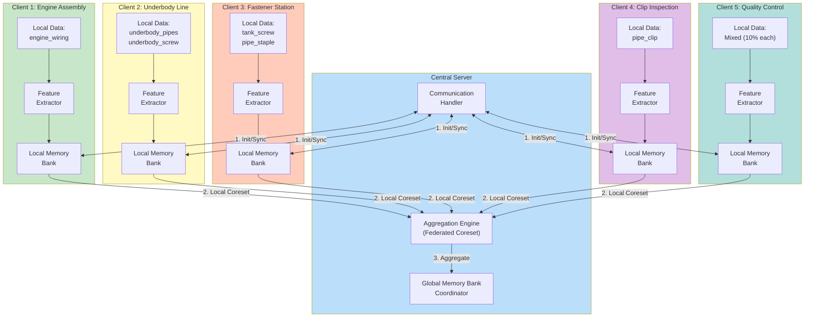
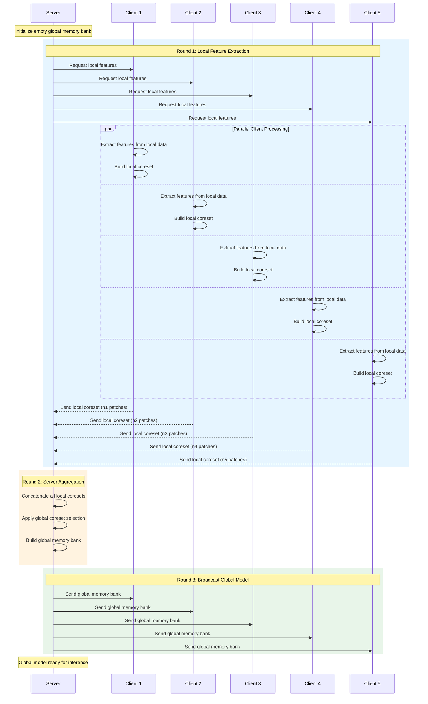
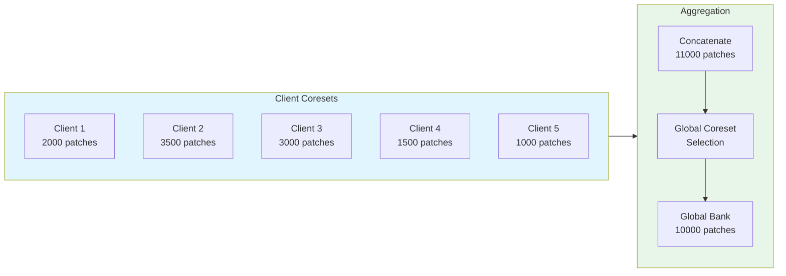

# Phase 3: Federated Setup

> **Objective**: Implement federated learning with 5 clients, adapting PatchCore for distributed memory bank aggregation.

---

## Overview

Phase 3 transforms the centralized PatchCore into a federated system where:
1. **5 clients** hold local data partitions
2. Each client extracts **local patch features** and builds a **local memory bank**
3. **Server aggregates** memory banks using federated coreset selection
4. Experiments compare **IID vs Category-based** partitioning

---

## Federated Architecture



---

## Federated Training Protocol



---

## Memory Bank Aggregation Strategy

### Algorithm: Federated Coreset

```python
def federated_aggregate(client_coresets, global_bank_size=10000):
    """
    Aggregate local memory banks from all clients.

    Strategy:
    1. Weight client contributions by data size (fairness)
    2. Concatenate all local coresets
    3. Apply global coreset selection for diversity
    """
    # Weight by client data size
    total_samples = sum(len(c) for c in client_coresets)
    weights = [len(c) / total_samples for c in client_coresets]

    # Sample from each client proportionally
    sampled_features = []
    for coreset, weight in zip(client_coresets, weights):
        n_samples = int(global_bank_size * weight * 2)  # Oversample
        if len(coreset) > n_samples:
            indices = np.random.choice(len(coreset), n_samples, replace=False)
            sampled_features.append(coreset[indices])
        else:
            sampled_features.append(coreset)

    # Concatenate
    all_features = np.concatenate(sampled_features, axis=0)

    # Global coreset selection for diversity
    global_bank = greedy_coreset_selection(all_features, global_bank_size)

    return global_bank
```

### Aggregation Flow



---

## Client Implementation

### Flower Client (Optional)

```python
import flwr as fl

class PatchCoreClient(fl.client.NumPyClient):
    def __init__(self, client_id, data_partition, backbone):
        self.client_id = client_id
        self.data = data_partition
        self.backbone = backbone
        self.local_memory = None

    def get_parameters(self, config):
        """Return local memory bank as parameters."""
        return [self.local_memory] if self.local_memory is not None else []

    def fit(self, parameters, config):
        """Extract features and build local memory bank."""
        # Extract features from local data
        features = self.extract_features(self.data)

        # Build local coreset
        self.local_memory = greedy_coreset_selection(
            features,
            target_size=int(len(features) * 0.1)
        )

        return [self.local_memory], len(self.data), {}

    def evaluate(self, parameters, config):
        """Evaluate using global memory bank."""
        global_memory = parameters[0]
        # Evaluation logic...
        return loss, len(self.data), {"accuracy": accuracy}
```

### Custom Simulation

```python
class FederatedPatchCore:
    def __init__(self, num_clients=5, global_bank_size=10000):
        self.num_clients = num_clients
        self.global_bank_size = global_bank_size
        self.clients = []
        self.global_memory = None

    def setup_clients(self, partitions, backbone):
        """Initialize clients with data partitions."""
        for i, partition in enumerate(partitions):
            client = PatchCoreClient(i, partition, backbone)
            self.clients.append(client)

    def train_round(self):
        """Execute one federated round."""
        # Collect local coresets
        local_coresets = []
        for client in self.clients:
            coreset = client.extract_and_build_coreset()
            local_coresets.append(coreset)

        # Aggregate
        self.global_memory = federated_aggregate(
            local_coresets,
            self.global_bank_size
        )

        return self.global_memory
```

---

## Experiment Configurations

### IID Partitioning

```yaml
# experiments/configs/federated/fedavg_iid_config.yaml
federated:
  num_clients: 5
  partitioning: "iid"

aggregation:
  strategy: "federated_coreset"
  global_bank_size: 10000

training:
  num_rounds: 1  # PatchCore is non-iterative
```

### Category-Based Partitioning

```yaml
# experiments/configs/federated/fedavg_category_config.yaml
federated:
  num_clients: 5
  partitioning: "category_based"
  client_assignments:
    0: ["engine_wiring"]
    1: ["underbody_pipes", "underbody_screw"]
    2: ["tank_screw", "pipe_staple"]
    3: ["pipe_clip"]
    4: ["all"]  # 10% mixed

aggregation:
  strategy: "federated_coreset"
  global_bank_size: 10000
  weighted_by_samples: true
```

---

## Communication Analysis

| Metric | Value |
|--------|-------|
| Upstream (per client) | ~50-200 MB (local coreset) |
| Downstream (broadcast) | ~200 MB (global bank) |
| Total communication | ~500 MB - 1.2 GB |
| Rounds | 1 (PatchCore is non-iterative) |

Note: PatchCore-based FL is communication-efficient because it only requires one round of coreset exchange, unlike gradient-based FL methods.

---

## Implementation Checklist

- [ ] Implement `PatchCoreClient` class in `src/federated/client.py`
- [ ] Implement `FederatedServer` class in `src/federated/server.py`
- [ ] Implement `federated_aggregate()` in `src/federated/strategies/federated_memory.py`
- [ ] Create IID partitioning experiment script
- [ ] Create category-based partitioning experiment script
- [ ] Create notebook `notebooks/03_federated_experiments.ipynb`
- [ ] Run both experiments and collect results

---

## Expected Outputs

```
outputs/federated/
├── iid/
│   ├── global_memory_bank.pt
│   ├── client_stats.json
│   └── training_log.json
└── category_based/
    ├── global_memory_bank.pt
    ├── client_stats.json
    └── training_log.json
```

---

## Related Documentation

- [Federated Training Workflow](workflows/federated-workflow.md) - Detailed BPMN
- [Memory Bank Synchronization](memory-bank-sync.md) - Deep dive
- [Phase 2: Baseline Model](../phase-2-baseline-model/README.md) - Previous phase
- [Phase 4: Evaluation](../phase-4-evaluation/README.md) - Next phase
