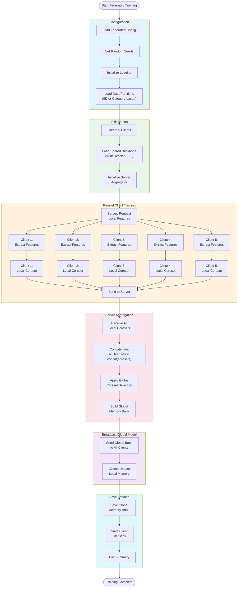
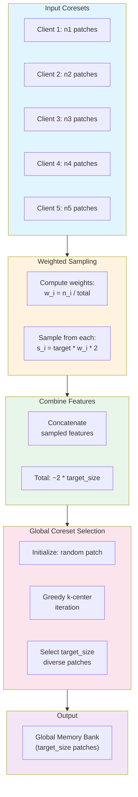
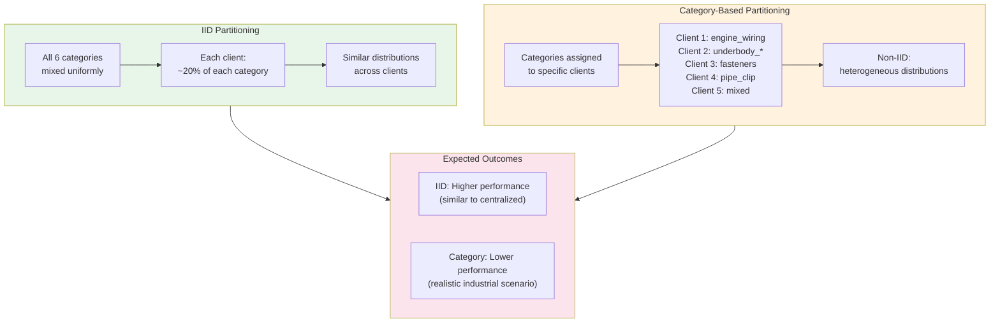
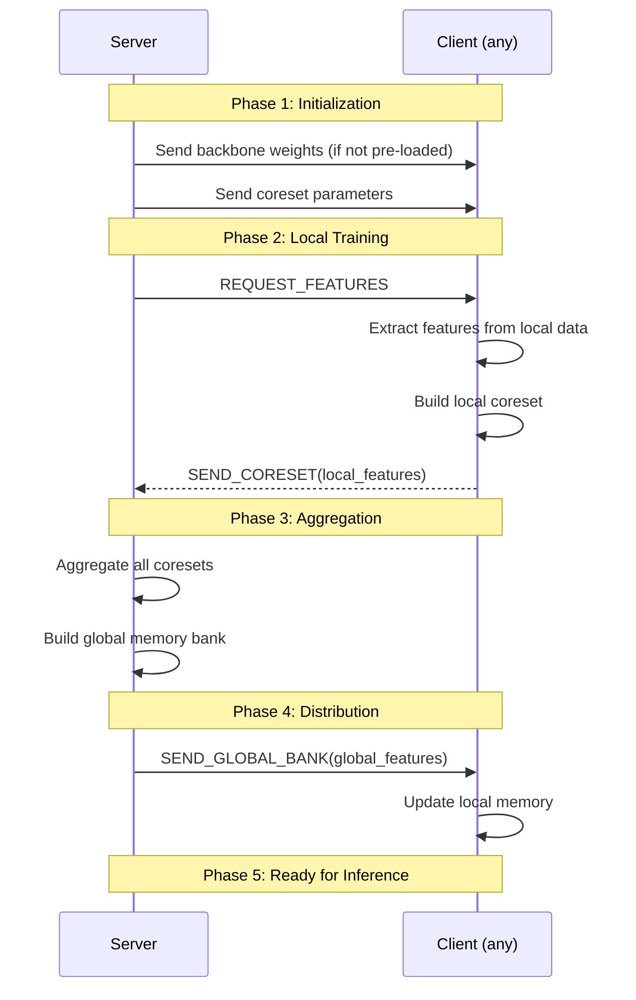
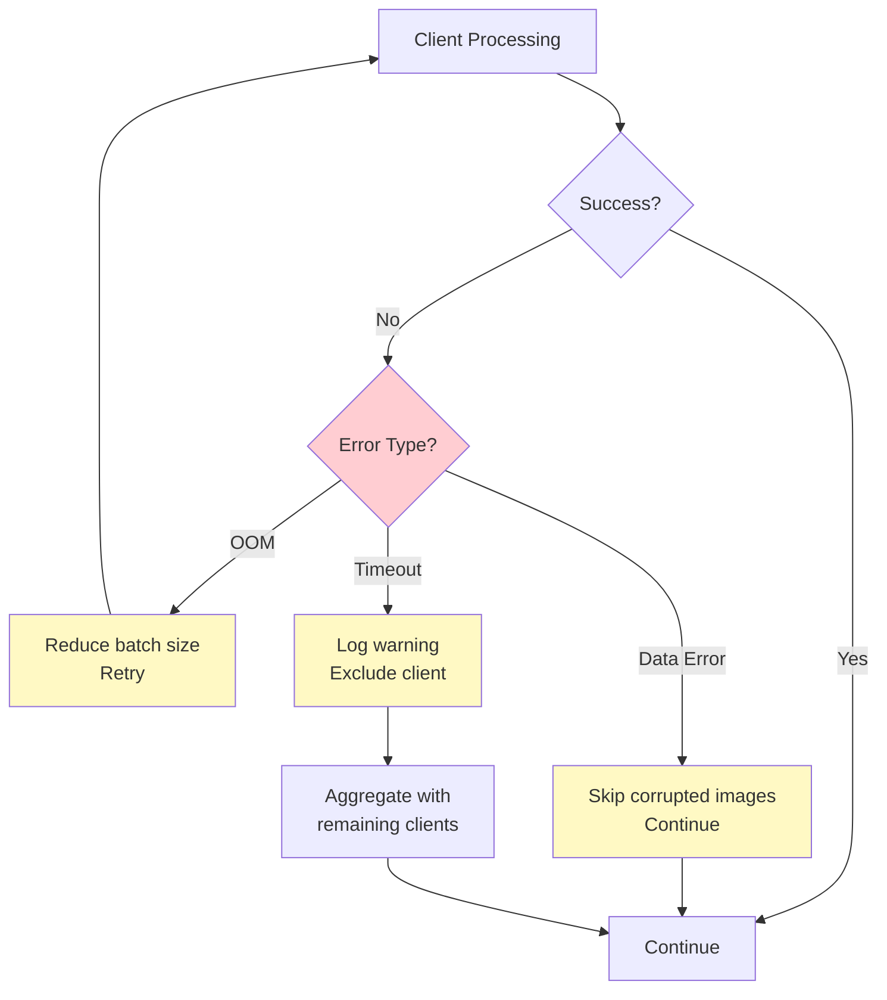

# Federated Training Workflow

> Detailed BPMN diagram for federated PatchCore training with memory bank aggregation.

---

## Complete Federated Training Pipeline

---

## Client Processing Detail

```mermaid
flowchart TB
    subgraph ClientProcess["Single Client Processing"]
        CP1["Receive Request\nfrom Server"] --> CP2["Load Local\nData Partition"]
        CP2 --> CP3["Initialize\nFeature List"]

        CP3 --> CP4["For Each Image\nin Partition"]
        CP4 --> CP5["Apply Preprocessing:\nResize + Normalize"]
        CP5 --> CP6["Forward Pass\nthrough Backbone"]
        CP6 --> CP7["Extract Layer2+3\nFeatures"]
        CP7 --> CP8["Concatenate +\nReshape to Patches"]
        CP8 --> CP9["Append to\nFeature List"]
        CP9 --> CP10{"More\nImages?"}
        CP10 -->|Yes| CP4
        CP10 -->|No| CP11["Stack All\nPatch Features"]

        CP11 --> CP12["Local Coreset\nSelection (10%)"]
        CP12 --> CP13["Return Coreset\nto Server"]
    end

    style ClientProcess fill:#e8f5e9
```

---

## Aggregation Algorithm Detail

---

## IID vs Category-Based Comparison

---

## Communication Protocol

---

## Error Handling

---

## Performance Metrics

| Metric | IID Expected | Category Expected |
|--------|--------------|-------------------|
| Training Time | ~15 min | ~15 min |
| Communication | ~1 GB | ~1 GB |
| AUC-sPRO@0.05 | ~0.75 | ~0.70 |
| Performance Gap vs Centralized | -3% | -8% |
