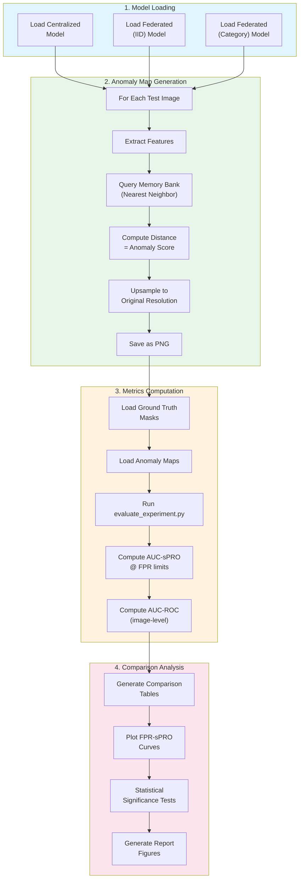

# Phase 4: Evaluation

> **Objective**: Evaluate and compare centralized vs federated models using standard anomaly detection metrics.

---

## Overview

Phase 4 focuses on:
1. **Anomaly map generation** from trained models
2. **Metrics computation** using existing evaluation code
3. **Comparison analysis** between centralized and federated approaches
4. **Statistical significance** testing

---

## Evaluation Pipeline



---

## Metrics Definition

### AUC-sPRO (Localization)

**sPRO (Saturated Per-Region Overlap)** measures pixel-level anomaly localization:

```
sPRO(defect) = min(TP_area / Saturation_Area, 1.0)
```

**AUC-sPRO** is computed over the FPR-sPRO curve at different FPR limits:

| FPR Limit | Description | Use Case |
|-----------|-------------|----------|
| 0.01 | Very strict | High-precision applications |
| 0.05 | Strict | Production quality control |
| 0.1 | Standard | General benchmarking |
| 0.3 | Relaxed | Initial screening |
| 1.0 | Full curve | Complete evaluation |

### AUC-ROC (Classification)

**Image-level** anomaly detection using max anomaly score:

```
image_score = max(anomaly_map)
```

ROC curve computed over good vs anomalous images.

---

## Integration with Existing Evaluation Code

The project includes existing evaluation code that can be directly used:

```python
# evaluate_experiment.py usage
python evaluate_experiment.py \
    --object_name engine_wiring \
    --dataset_base_dir /path/to/autovi/ \
    --anomaly_maps_dir outputs/anomaly_maps/ \
    --output_dir outputs/metrics/
```

### Key Functions

| Function | File | Purpose |
|----------|------|---------|
| `read_maps()` | evaluate_experiment.py | Load GT and anomaly maps |
| `get_auc_spros_for_metrics()` | evaluate_experiment.py | Compute AUC-sPRO |
| `MetricsAggregator` | src/aggregation.py | Threshold refinement |
| `get_spros_for_thresholds()` | src/metrics.py | sPRO computation |

---

## Anomaly Map Generation

```python
def generate_anomaly_maps(model, test_dataset, output_dir):
    """
    Generate pixel-wise anomaly maps for evaluation.

    Args:
        model: Trained PatchCore model (centralized or federated)
        test_dataset: AutoVI test set
        output_dir: Directory for saving anomaly maps
    """
    model.backbone.eval()

    for image, label, rel_path in test_dataset:
        # Extract features
        features = model.extract_features(image.unsqueeze(0))

        # Query memory bank
        distances, _ = model.memory_bank.search(features, k=1)

        # Reshape to spatial dimensions
        h, w = features.shape[2], features.shape[3]
        anomaly_map = distances.reshape(h, w)

        # Upsample to original size
        anomaly_map = F.interpolate(
            anomaly_map.unsqueeze(0).unsqueeze(0),
            size=image.shape[1:],
            mode='bilinear'
        ).squeeze()

        # Normalize and save
        anomaly_map = (anomaly_map - anomaly_map.min()) / (anomaly_map.max() - anomaly_map.min())
        anomaly_map_uint8 = (anomaly_map * 255).byte()

        save_path = os.path.join(output_dir, rel_path)
        os.makedirs(os.path.dirname(save_path), exist_ok=True)
        Image.fromarray(anomaly_map_uint8.numpy()).save(save_path)
```

---

## Evaluation Script

```bash
# experiments/scripts/evaluate_all.py

# 1. Generate anomaly maps
python generate_anomaly_maps.py \
    --model_type centralized \
    --model_path outputs/baseline/patchcore_all.pt \
    --output_dir outputs/anomaly_maps/centralized/

python generate_anomaly_maps.py \
    --model_type federated \
    --model_path outputs/federated/iid/global_memory_bank.pt \
    --output_dir outputs/anomaly_maps/federated_iid/

python generate_anomaly_maps.py \
    --model_type federated \
    --model_path outputs/federated/category/global_memory_bank.pt \
    --output_dir outputs/anomaly_maps/federated_category/

# 2. Run evaluation
for object in engine_wiring pipe_clip pipe_staple tank_screw underbody_pipes underbody_screw; do
    for method in centralized federated_iid federated_category; do
        python evaluate_experiment.py \
            --object_name $object \
            --dataset_base_dir /path/to/autovi/ \
            --anomaly_maps_dir outputs/anomaly_maps/$method/$object/ \
            --output_dir outputs/metrics/$method/$object/
    done
done

# 3. Generate comparison report
python generate_comparison_report.py \
    --metrics_dirs outputs/metrics/ \
    --output_dir outputs/reports/
```

---

## Results Format

### Per-Object Metrics (JSON)

```json
{
  "object_name": "engine_wiring",
  "method": "federated_category",
  "localization": {
    "auc_spro": {
      "0.01": 0.72,
      "0.05": 0.80,
      "0.1": 0.85,
      "0.3": 0.90,
      "1.0": 0.93
    },
    "per_defect": {
      "structural_anomalies": {"0.05": 0.82},
      "logical_anomalies": {"0.05": 0.78}
    }
  },
  "classification": {
    "auc_roc": 0.91,
    "per_type": {
      "structural_anomalies": 0.93,
      "logical_anomalies": 0.88
    }
  }
}
```

### Comparison Table

| Object | Centralized | Fed (IID) | Fed (Category) | Gap (IID) | Gap (Cat) |
|--------|-------------|-----------|----------------|-----------|-----------|
| engine_wiring | 0.85 | 0.82 | 0.78 | -3% | -7% |
| pipe_clip | 0.82 | 0.80 | 0.75 | -2% | -7% |
| pipe_staple | 0.80 | 0.78 | 0.72 | -2% | -8% |
| tank_screw | 0.78 | 0.75 | 0.70 | -3% | -8% |
| underbody_pipes | 0.75 | 0.72 | 0.68 | -3% | -7% |
| underbody_screw | 0.70 | 0.68 | 0.65 | -2% | -5% |
| **Mean** | **0.78** | **0.76** | **0.71** | **-3%** | **-7%** |

---

## Visualization

### FPR-sPRO Curves

```python
import matplotlib.pyplot as plt

def plot_fpr_spro_comparison(metrics_dict, object_name):
    """Plot FPR-sPRO curves for all methods."""
    fig, ax = plt.subplots(figsize=(8, 6))

    for method, metrics in metrics_dict.items():
        fprs = metrics['fprs']
        spros = metrics['spros']
        ax.plot(fprs, spros, label=method)

    ax.set_xlabel('False Positive Rate')
    ax.set_ylabel('Mean sPRO')
    ax.set_title(f'FPR-sPRO Curve: {object_name}')
    ax.legend()
    ax.set_xlim(0, 0.3)
    ax.set_ylim(0, 1)

    return fig
```

### Per-Category Performance Bar Chart

```mermaid
xychart-beta
    title "AUC-sPRO@0.05 by Method"
    x-axis ["engine", "pipe_clip", "pipe_staple", "tank_screw", "underbody_p", "underbody_s"]
    y-axis "AUC-sPRO" 0 --> 1
    bar [0.85, 0.82, 0.80, 0.78, 0.75, 0.70]
    bar [0.82, 0.80, 0.78, 0.75, 0.72, 0.68]
    bar [0.78, 0.75, 0.72, 0.70, 0.68, 0.65]
```



---

## Statistical Analysis

### Paired t-test

Compare centralized vs federated performance:

```python
from scipy import stats

# Per-object AUC-sPRO values
centralized_scores = [0.85, 0.82, 0.80, 0.78, 0.75, 0.70]
federated_scores = [0.78, 0.75, 0.72, 0.70, 0.68, 0.65]

t_stat, p_value = stats.ttest_rel(centralized_scores, federated_scores)
print(f"t-statistic: {t_stat:.3f}, p-value: {p_value:.4f}")

# Effect size (Cohen's d)
diff = np.array(centralized_scores) - np.array(federated_scores)
cohens_d = diff.mean() / diff.std()
print(f"Cohen's d: {cohens_d:.3f}")
```

---

## Implementation Checklist

- [ ] Implement anomaly map generator in `src/evaluation/anomaly_scorer.py`
- [ ] Create metrics wrapper in `src/evaluation/metrics_wrapper.py`
- [ ] Create visualization utilities in `src/evaluation/visualization.py`
- [ ] Create evaluation script `experiments/scripts/evaluate_all.py`
- [ ] Create comparison report generator
- [ ] Create notebook `notebooks/04_results_analysis.ipynb`
- [ ] Generate all comparison tables and figures

---

## Output Files

```
outputs/
├── anomaly_maps/
│   ├── centralized/{object}/{image}.png
│   ├── federated_iid/{object}/{image}.png
│   └── federated_category/{object}/{image}.png
├── metrics/
│   ├── centralized/{object}/metrics.json
│   ├── federated_iid/{object}/metrics.json
│   └── federated_category/{object}/metrics.json
└── reports/
    ├── comparison_table.csv
    ├── fpr_spro_curves.pdf
    └── summary_report.md
```

---

## Related Documentation

- [Evaluation Workflow](workflows/evaluation-workflow.md) - Detailed BPMN
- [Metrics Definition](metrics-definition.md) - Deep dive into sPRO/ROC
- [Phase 3: Federated Setup](../phase-3-federated-setup/README.md) - Previous phase
- [Technical Report](../../technical-report/README.md) - Final deliverable
