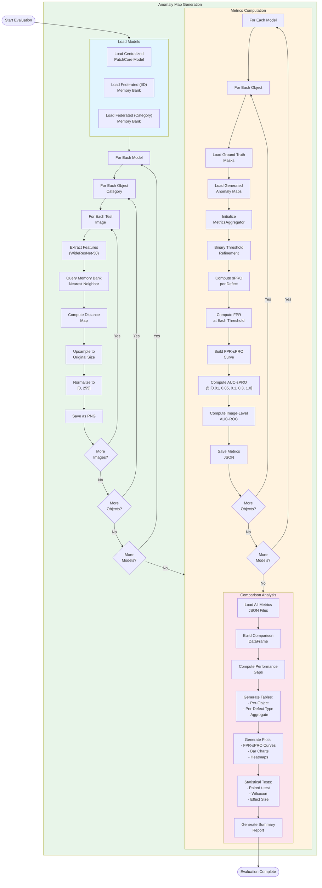
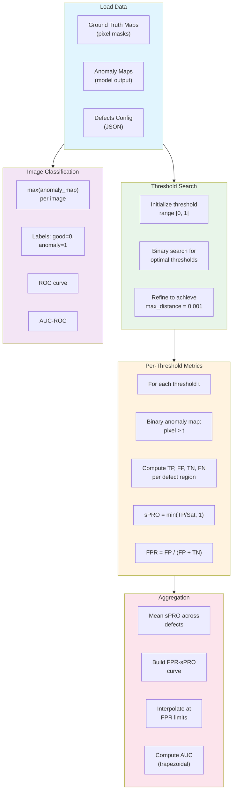
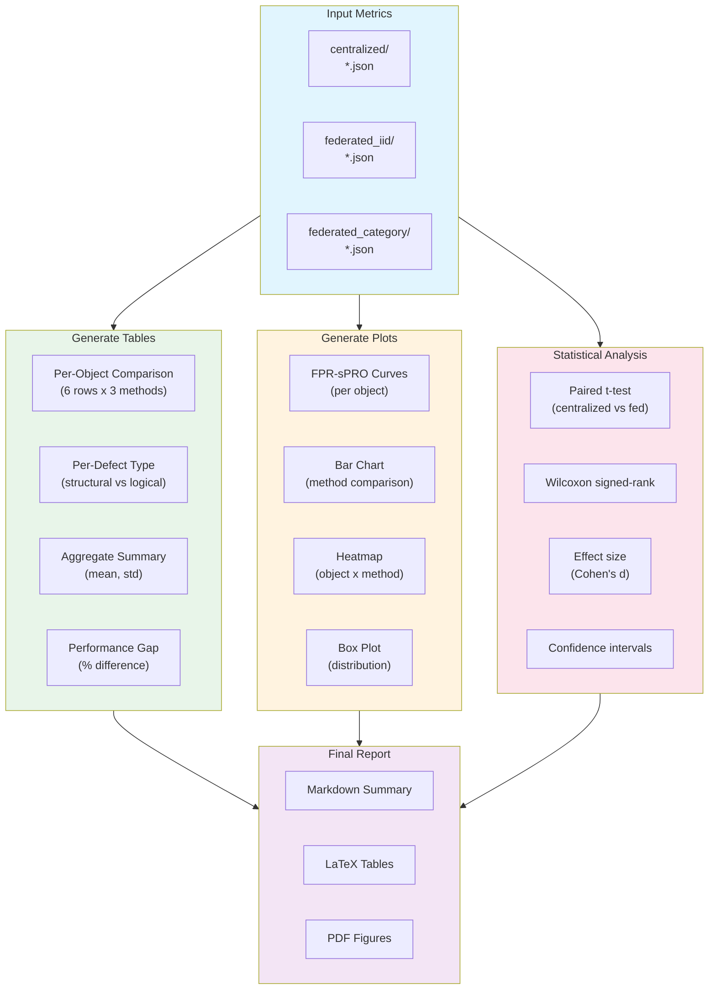
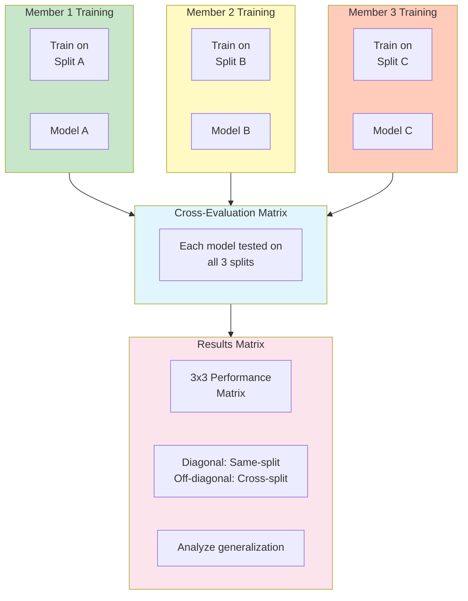

# Evaluation Workflow

> Detailed BPMN diagram for model evaluation and comparison analysis.

---

## Complete Evaluation Pipeline

---

## Anomaly Map Generation Detail

```mermaid
flowchart LR
    subgraph Input["Input"]
        I1["Test Image\n[3, H, W]"]
    end

    subgraph Extract["Feature Extraction"]
        E1["WideResNet-50\n(frozen)"]
        E2["Layer 2+3\nFeatures"]
        E3["Patch Grid\n[N, 1536]"]
    end

    subgraph Query["Memory Query"]
        Q1["FAISS Index\n(Memory Bank)"]
        Q2["k-NN Search\n(k=1)"]
        Q3["Distance Values"]
    end

    subgraph Output["Output"]
        O1["Reshape to\n[H/8, W/8]"]
        O2["Bilinear Upsample\n[H, W]"]
        O3["Normalize\n[0, 255]"]
        O4["Save PNG"]
    end

    Input --> Extract --> Query --> Output

    style Input fill:#e1f5fe
    style Extract fill:#e8f5e9
    style Query fill:#fff3e0
    style Output fill:#fce4ec
```

---

## Metrics Computation Detail

---

## Comparison Report Generation

---

## Cross-Evaluation Protocol (Team)

---

## Output Artifacts Summary

| Artifact | Path | Format |
|----------|------|--------|
| Anomaly maps | `outputs/anomaly_maps/{method}/{object}/` | PNG |
| Per-object metrics | `outputs/metrics/{method}/{object}/metrics.json` | JSON |
| Comparison table | `outputs/reports/comparison_table.csv` | CSV |
| FPR-sPRO curves | `outputs/reports/fpr_spro_curves.pdf` | PDF |
| Statistical analysis | `outputs/reports/statistical_analysis.json` | JSON |
| Summary report | `outputs/reports/summary_report.md` | Markdown |
